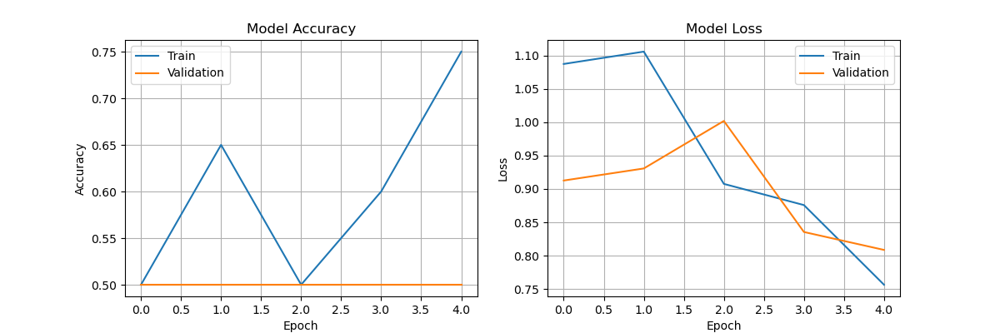

# 🐱🐶 Cat vs Dog Image Classification – Convolutional Neural Network (CNN)

**Quick Snapshot:**

- Classify images of **cats and dogs** using a **Convolutional Neural Network (CNN)**.
- Demonstrates an end-to-end deep learning workflow: **image preprocessing, data augmentation, CNN modeling, evaluation, and prediction**.


## 📌 Project Overview

This project applies **deep learning with CNNs** to solve a **binary image classification problem**: identifying whether an image contains a **cat or a dog**.

The notebook showcases:
- Image preprocessing and augmentation
- CNN architecture design
- Regularization to reduce overfitting
- Model evaluation and visualization
- Single-image prediction for real-world inference

---

## 🎯 Background

Image classification is a core computer vision task used in:
- Medical imaging
- Autonomous vehicles
- Content moderation
- Retail and animal recognition systems

CNNs are especially effective because they:
- Learn **spatial features automatically**
- Capture edges, textures, and shapes
- Scale well to real-world image data

---

## 🗂️ Dataset Overview

**Source:** Educational dataset (Data Science Bootcamp)

**Dataset Structure (Demo Sample):**

- Training images: 20 (10 cats, 10 dogs)
- Test images: 20 (10 cats, 10 dogs)
- Single prediction images: 4 (2 cats, 2 dogs)

**Directory Structure Used:**
```
data_sample/
├─ training_set/
│  ├─ cats/
│  └─ dogs/
├─ test_set/
│  ├─ cats/
│  └─ dogs/
└─ single_prediction/
   ├─ cat1.jpg
   ├─ cat2.jpg
   ├─ dog1.jpg
   └─ dog2.jpg
```

**Problem Type:** Supervised learning – **Binary Image Classification (Cat vs Dog)**

> **⚠️ Disclaimer**
This repository uses a small sample dataset for demonstration purposes.
Performance metrics are intended to illustrate model behavior and learning dynamics, not production-level accuracy.

---

## 🛠️ Tools I Used

- Python
- TensorFlow / Keras
- NumPy
- Matplotlib
- Jupyter Notebook

---

## 🚀 Getting Started

### Prerequisites

* Python 3.11 or higher
* Jupyter Notebook or Google Colab
* TensorFlow installed

### Installation

1. **Clone the repository**

   ```bash
   git clone https://github.com/NadiaRozman/Cat_vs_Dog_CNN.git
   ```

2. **Install dependencies:**

   ```bash
   pip install tensorflow numpy matplotlib
   ```

3. **Open and run the notebook**

   * Navigate to `Cat_vs_Dog_CNN_Classifier.ipynb`
   * Ensure `data_sample/` exist in root directory
   * Run all cells sequentially

---

## 🔬 CNN Model Implementation

**1. Image Preprocessing:** 
   - Image resizing to 128×128
   - Pixel normalization (`rescale 1./255`)
   - Data augmentation: Horizontal flip, Zoom, Shear

**2. CNN Architecture:**
   - Input: 128×128 RGB images
   - **2 Convolutional layers** with ReLU activation
   - MaxPooling after each convolution
   - Dropout and L2 weight regularization
   - Fully connected dense layers
   - Output layer with **Sigmoid activation**

**3. Training Configuration:**
   - Optimizer: Adam
   - Loss Function: Binary Crossentropy
   - Early stopping based on validation loss

---

## 📊 Demo Training Results (Sample Dataset)

```
Training Accuracy:    0.75
Validation Accuracy:  0.50
Training Loss:        0.76
Validation Loss:      0.81
```

### **Interpretation of Results**

- Model learns patterns from limited data (75% training accuracy)
- Validation is chance-level (50%), expected with tiny dataset
- Dropout + L2 helps prevent overfitting but slows convergence
- Individual images can heavily sway validation metrics

> Small dataset → results are illustrative, not production-ready

---

## 📊 Experimental Results (Architecture Experiments)

### **Resolution & Architecture Comparison**

> **Note:**  
> Table shows multiple CNN experiments for comparison. The notebook demonstrates the 128×128 – 2 Conv model on a small demo dataset.


| Model Config         | Train Acc  | Train Loss | Val Acc    | Val Loss   | Best Epoch |
| -------------------- | ---------- | ---------- | ---------- | ---------- | ---------- |
| **64×64 – 2 Conv**   | 0.8634     | 0.3182     | 0.8190     | 0.4286     | 25         |
| **128×128 – 2 Conv** | 0.8273     | 0.3933     | 0.7910     | 0.4747     | 11         |
| **128×128 – 3 Conv** | **0.9066** | **0.2186** | **0.8450** | **0.4183** | **21**         |


**Observations**
- **64×64, 2-Conv:** Steady learning, fewer spatial details
- **128×128, 2-Conv:** Fast convergence, slightly lower validation
- **128×128, 3-Conv:** Best validation, strongest features, longer training

**Key Insight**
- **Resolution alone ≠ better performance**
- **Deeper + higher resolution** → richer features → stronger generalization

---

## 📈 Training Performance Visualization



*Figure 1: Severe overfitting: training accuracy 75%, validation flat at 50%; training loss drops to 0.76, validation rises to 0.81.*

---

## 🐾 Single Image Prediction

**Example Predictions (Demo):**

| Image    | Prediction |
| -------- | ---------- |
| cat1.jpg | Cat        |
| cat2.jpg | Cat        |
| dog1.jpg | Dog        |
| dog2.jpg | Dog        |

> Predictions may vary due to small dataset size and randomness, but pipeline demonstrates inference logic

---

## 💡 Insights & Practical Takeaways

- CNNs learn meaningful features even from small datasets
- Data augmentation is essential for limited data
- Regularization improves validation stability and generalization
- Visualizing training curves helps diagnose overfitting

---

## 📚 What I Learned

- CNNs extract hierarchical visual features
- Directory structure is critical in image pipelines
- Image resolution impacts model performance
- How to interpret training vs validation behavior
- Translating technical results into actionable insights

---

## 🔮 Future Enhancements
- Train on a larger dataset (e.g., Kaggle Cats vs Dogs)
- Add batch normalization
- Experiment with transfer learning (VGG16, ResNet)
- Deploy as a web app (Streamlit)
- Compare CNN vs pretrained models

---

### ✨ Created by Nadia Rozman | January 2026

📂 **Project Structure**
```
Cat_vs_Dog_CNN/
│
├── data_sample/
│   ├── training_set/
│   │   ├── cats/
│   │   └── dogs/
│   ├── test_set/
│   │   ├── cats/
│   │   └── dogs/
│   └── single_prediction/
│       ├── cat1.jpg
│       ├── cat2.jpg
│       ├── dog1.jpg
│       └── dog2.jpg
│
|├── notebook/
│   └── Cat_vs_Dog_CNN_Classifier.ipynb
|
├── plot/
│   └── cnn_training_curves.png
│
└── README.md
```

**🔗 Connect with me**
- GitHub: [@NadiaRozman](https://github.com/NadiaRozman)
- LinkedIn: [Nadia Rozman](https://www.linkedin.com/in/nadia-rozman-4b4887179/)

**⭐ If you found this project helpful, please consider giving it a star!**